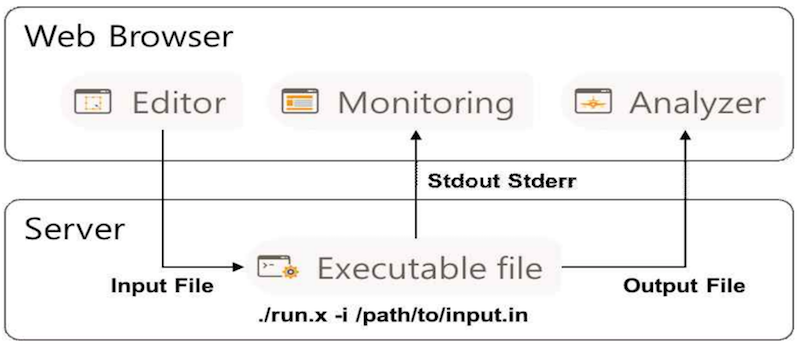
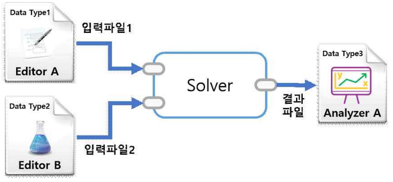

# 사이언스 앱 개요

EDISON에서 사용자가 특정 문제를 해석하기 위한 웹기반 시뮬레이션 소프트웨어를 사이언스 앱이라 정의합니다. 단일 시뮬레이션을 실행하는 경우와 사이언스 앱을 순차적으로 실행시키기 위한 워크플로우에서 사용자가 등록한 앱을 활용할 수 있도록 구성 요소를 5가지로 나누었습니다.

## 사이언스 앱 구성요소

|요소| 설명|
|--|--|
|해석기 (Solver) |과학/기술 분야의 문제를 해결하기 위해 개발한 리눅스 실행 파일이나 스크립트 파일로 입출력 포트를 설정하여 입출력 데이터를 설정 할 수 있습니다. 명령행 인자(Command Line Argument) 방식으로 입력 데이터를 파일 형태로 읽고 result 폴더를 생성해 결과 데이터를 파일 형태로 출력합니다.|
|입출력포트 (Input/Output Port)|해석기의 입력 파일과 출력 파일의 형태를 정의해주는 요소로써 1개의 데이터 타입을 가지게 됩니다. 앱 등록시 데이터 타입 지정하여 생성해야 합니다.  |
|데이터타입 (Data Type)|사이언스 앱에서 생성되는 데이터의 형태를 구분하는 요소로써 1개 이상의 편집기와 분석기를 가지고 있습니다.|
|편잡기 (Editor)|웹 GUI를 통해 사용자의 입력을 받아 해석기의 입력 데이터를 만들어주는 요소로써 해석기의 입력 파일을 생성합니다. Liferay의 Portlet 형태로 개발되어야 합니다. |
|분석기 (Analyzer)|해석기를 통해 생성된 결과 데이터를 웹상에서 분석 작업을 할 수 있는 요소로써 해석기 결과 데이터를 파일형태로 읽어 웹상에서 표시해줍니다. Liferay의 Portlet 형태로 개발되어야 합니다. |

사이언스 앱은 웹을 통해 입력 데이터를 처리하는 편집기, 입력된 데이터를 통해 문제를 해석하는 해석기, 해석된 결과 데이터를 웹상에서 분석하는 분석기로 나누어집니다. 해석기는 입출력 형태를 정의하기 위한 입출력 포트를 가지고 있으며, 입출력 포트의 데이터 형태를 지정하는 데이터 타입을 정할 수 있습니다.

위 그림은 사이언스 앱 구성요소 중 해석기와 데이터 타입의 구조를 나타낸 그림입니다. (a)해석기는 여러 개의 입출력 포트를 가지고 있으며, 각각의 입출력 포트는 1개의 데이터 타입을 가지게 됩니다. 데이터 타입의 경우 1개 이상의 편집기와 분석기를 가질수 있습니다. 사이언스 앱 개발자는 입출력 포트 등록 시 기존에 등록되어 있는 데이터 타입을 사용할 수 있습니다.

## 사이언스 앱 실행 방식

사이언스 앱 실행 방식은 웹 브라우저에서 실행하는 부분과 서버에서 실행하는 부분으로 나눌수 있습니다. 사용자가 EDISON에서 앱을 실행하게 되면, 웹 브라우저에서 편집기를 통해 시뮬레이션 실행에 필요한 입력데이터를 생성할 수 있습니다. 입력데이터는 파일형태로 저장하여 서버로 전송되고 해석기는 명령행 인자(Command Line Argument) 방식으로 입력 파일을 읽어 시뮬레이션을 수행하게 됩니다. 해석기가 실행 중 Sdtout, Stderr 형태로 정보를 출력하게되면 사용자가 웹에서 실행 도중 모니터링을 통해 중간 해석 정보를 확인할 수 있습니다. 해석 종료 이후 result 폴더를 생성해 파일 형태로 결과 데이터를 저장하게 됩니다. 웹브라우저에서 분석기는 해석 결과 파일을 읽어 사용자에게 데이터를 가시화할 수 있습니다.

## 단일 앱 실행 구조

위 그림은 사이언스 앱을 실행하는 경우로 1개의 해석기가 2개의 입력 포트와 1개의 출력 포트를 갖는 경우를 도식화한 그림입니다. 2개의 입력 포트에서는 각 포트는 데이터 타입이 설정되어 있고, 데이터 타입이 가지고 있는 편집기를 통해 입력 파일을 생성할 수 있습니다. 출력 포트의 경우에도 포트는 데이터 타입이 설정되어 있고, 데이터 타입이 가지고 있는 분석기를 통해 결과 파일을 확인할 수 있습니다.

## 워크플로우 실행 구조

위 그림은 워크플로우를 이용하여 2개의 해석기를 연동하여 실행하는 경우를 도식화한 그림입니다. 워크플로우에서는 해석기 A의 출력 포트의 데이터 타입과 해석기 B의 입력 포트의 데이터 타입이 같은 경우 이를 연결할 수 있으며, 한 번에 실행할 수 있는 기능을 제공하고 있습니다.
