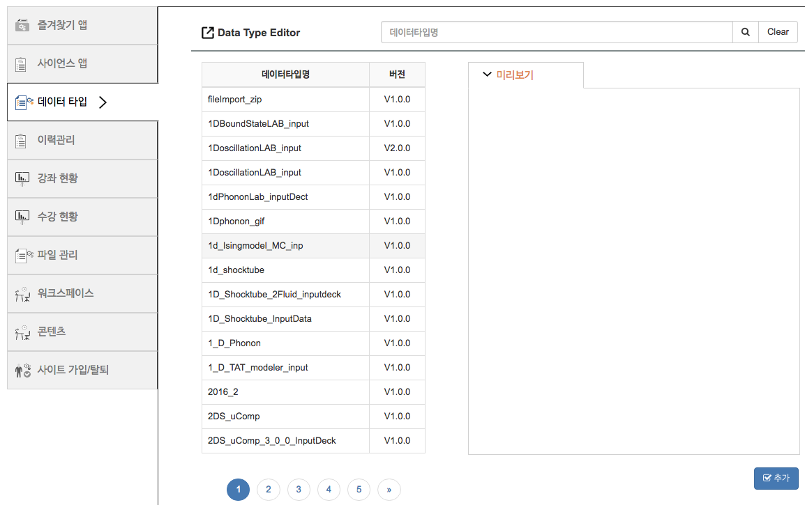
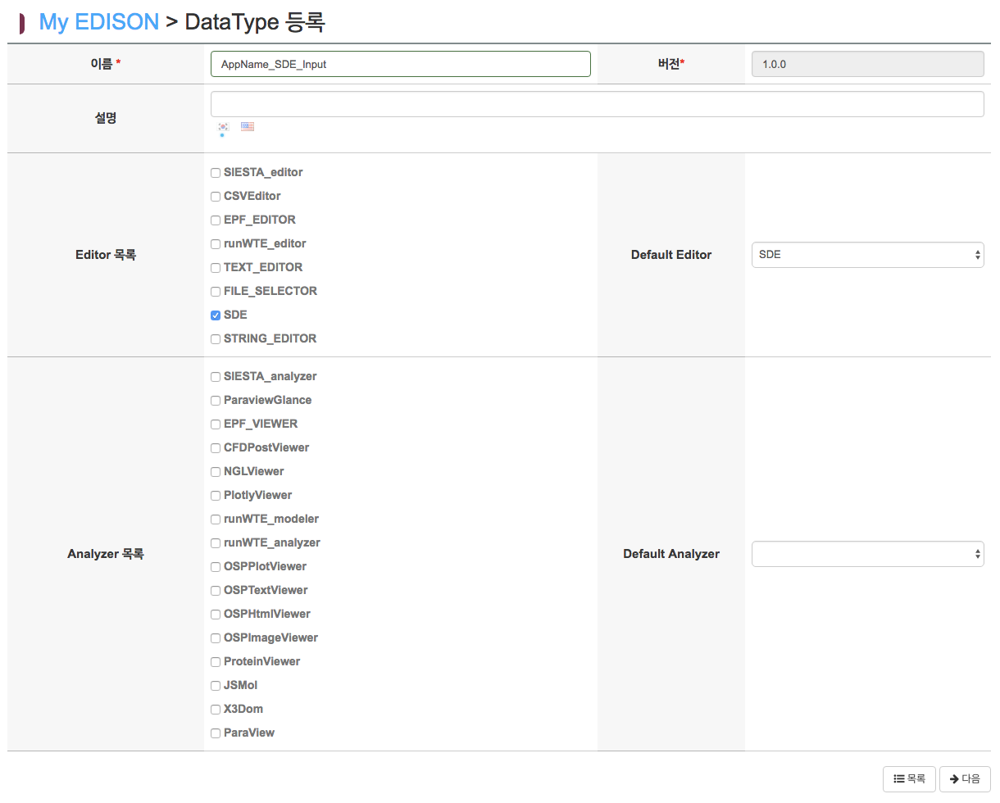
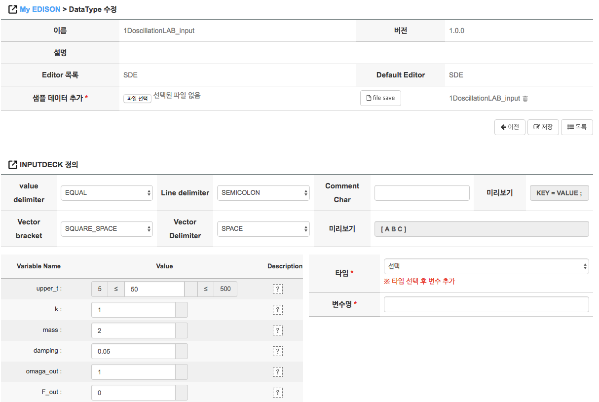
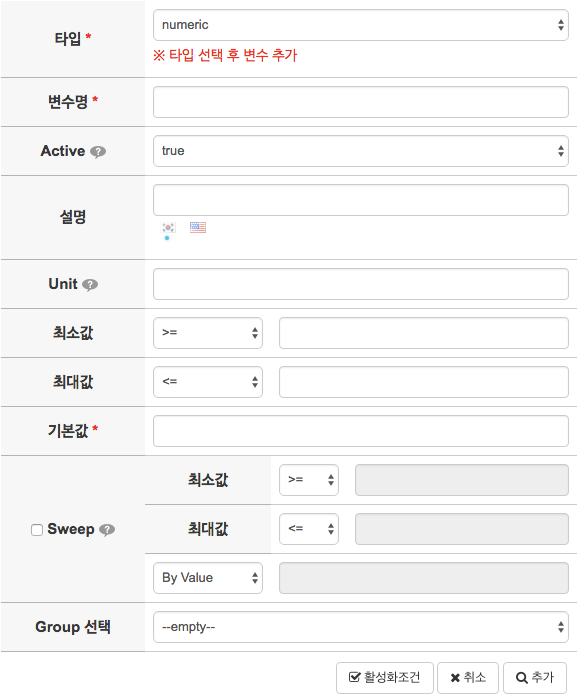
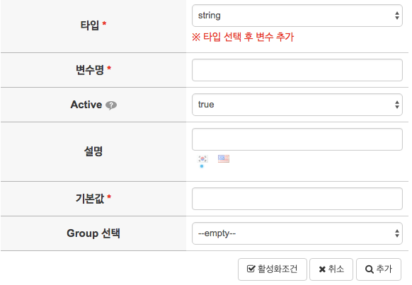
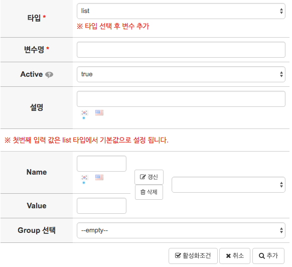
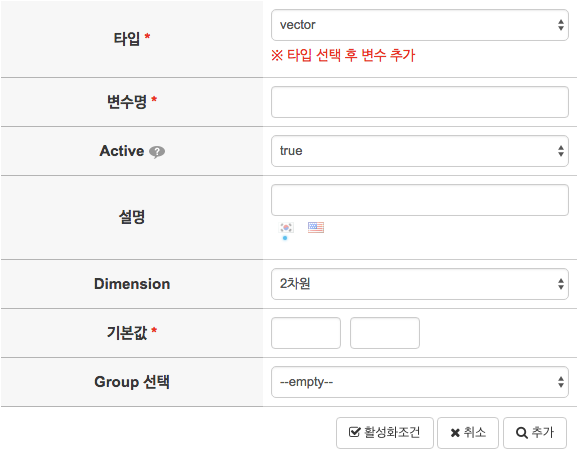
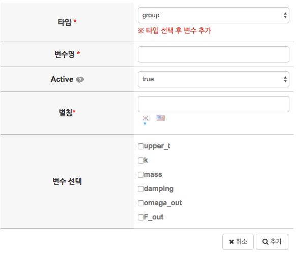

# Structured Data Editor (SDE)

EDISON 플랫폼에서는 SDE(Structured Data Editor) 이라는 기능을 제공하여, 시뮬레이션 수행에 필요한 변수 값, 문자열, 벡터등의 데이터를 웹에서 바로 입력할 수 있는 기능을 제공하고 있습니다.

> EDISON 사업 초창기  Inputdeck으로 불리던 데이터 형태를 Structured Data Editor로 명칭을 변경하였습니다.


# SDE 편집기


SDE를 자신의 시뮬레이션 SW에 활용하고 싶다면, SDE에서 생성되는 입력 파일을 읽을 수 있도록 프로그램을 작성해야 합니다. SDE 작성 시 입력 파일을 생성하는 규칙을 정할 수 있으며, 이 규칙에 따라 생성된 입력 파일을 읽어 올 수 있으면 됩니다. 프로그램 작성 시 유의 사항은 다음과 같습니다.
 - SDE 생성 규칙에 맞게 변수 값을 읽어와야 함
 - SDE 데이터의 생성 순서에 상관 없이도 동작해야 함
 - 원하는 변수 값들이 정상적으로 입력되지 않았다면 에러 메시지를 발생 시켜야 함


# SDE을 이용해 Datatype 만들기
## Datatype 생성
My EDISON > Datatype 관리 > 추가를 통해 신규 Datatype을 생성할 수 있습니다.



## SDE Editor 선택
생성 시 Datatype의 이름과 설명 그리고 사용하고자 하는 Editor를 선택할 수 있습니다. Editor 목록에서 SDE을 선택하고 ```다음``` 버튼을 누르면 SDE을 Editor로 사용하는 Datatype를 생성할 수 있습니다.



## Datatype 편집

### 샘플 데이터 등록


우선 해당 Datatype의 샘플 파일을 업로드 해야합니다.

### 데이터 생성 규칙 설정


SDE 정의 화면을 통해 변수와 벡터의 데이터가 생성되는 규칙을 설정할 수 있습니다. 해당 규칙으로 입력 파일이 생성됩니다. 각 기능에 대한 설명은 다음과 같습니다.

|기능 |설명 |
|--|--|
|value delimiter | 변수 이름과 변수 값을 구분해 주는 기호를 설정하는 부분이다. ```EQUAL```과 ```SPACE```를 선택할 수 있다.|
|Line delimiter | 하나의 변수가 종료 됨을 알려주는 문자를 선택할 수 있다. 기본적으로 변수간에 자동 줄바꿈이 들어가 있으며, ```SEMICOLON, COLON, NULL``` 중에 하나를 선택할 수 있다.|
|Comment Char | 입력 파일에 주석 처리를 하고자 하는 경우 주석 문의 시작 문자를 설정
|Vector bracket | 벡터 변수 사용시 괄호의 종류를 선택할 수 있다. ```SQUARE, ROUND, SQUARE_SPACE, ROUND_SPACE``` 선택 가능하며 _SPACE가 붙은 경우에는 괄호와 벡터 원소 사이에 space가 들어가 있는 상태로 생성된다.|
|Vector Delimiter | 벡터 원소간 구분해 주는 기호를 설정 ```COMMA```와 ```SPACE``` 중에 하나를 설정할 수 있다.|

미리보기를 통해 설정한 기능에 따라 생성되는 결과 형태를 확인 할 수 있습니다.

> ```value delimiter```를 ```EQUAL```, ```Line delimiter```를 ```SEMICOLON```로 지정한 경우 변수는 ```KEY = VALUE ;``` 형태로 생성되게 됩니다.
> 여기에 ```Vector bracket```를 ```SQUARE_SPACE```, ```Vector Delimiter```를 ```SPACE```로 지정한 경우 3차원 벡터는 ```KEY_VECTOR = [ VALUE1 VALUE2 VALUE3 ] ;``` 형태로 생성되게 됩니다.

## 변수 생성

변수 생성 화면은 다음과 같습니다. 오른쪽 메뉴를 통해 변수를 생성할 수 있습니다. 생성된 변수들로 실제 데이터를 입력받는 화면은 왼쪽에 표시되게 됩니다.


변수 타입은 numeric, string, vector, string, group, comment로 나누어 지며 각 타입별 생성 방법은 다음과 같습니다.

### numeric
변수가 숫자 값을 입력 받는 경우 이 타입을 설정하면 됩니다. 최대 최소 값 설정이 가능 및 sweep 기능을 사용할 수 있습니다.

> sweep 기능 설정시 한번에 여러 개의 시뮬레이션 작업을 생성 할 수 있습니다.



|기능 |설명 |
|--|--|
|변수명 | 생성하는 변수의 이름을 지정할 수 있습니다. 입력 데이터 생성시 이 값이 KEY 값으로 생성됩니다. |
|Active | true, false를 설정할 수 있으며, 해당값이 false일 경우 데이터 입력 창이 보이지 않게 됩니다. <br>사용자에게는 입력 받을 필요가 없는 고정 변수 값을 생성할때 false 지정하여 사용하면 됩니다. |
|설명| 해당 변수의 대한 설명을 입력할 수 있습니다. 입력창 아래 국기를 선택해 다국어를 입력 할 수 있습니다.|
|Unit| 변수의 단위가 있는 경우 해당 단위를 입력합니다. |
|최소값, 최대값 | 변수가 입력되는 최대값과 최소값 범위를 지정할 수 있습니다. 지정한 최대 최소값을 포함할지 안할지 결정할 수 있습니다. |
|기본값 | 기본으로 표시되는 값을 입력합니다.|
|Sweep | sweep 기능 사용 유무를 체크할 수 있으며, 체크시 기본 값을 지정할 수 있습니다. <br>입력받는 값으로는 sweep 최소값과 sweep 최대값이 있으며, 작업을 생성하는 방식으로는 By Value와 By Slice가 있습니다. |
|Group|Group 변수가 생성되어 있는 경우 원하는 Group 변수에 포함시킬 수 있습니다.|

> Sweep 기능 설명
> - By Value : 최소값(시작값), 최대값(종료값)을 일정한 간격으로 입력한 값(step)으로 나누어 작업 생성
> - By Slice : 최소값(시작값), 최대값(종료값)을 입력한 갯수로 나누어 작업 생성


### string

한 줄의 문자열을 입력 받을 때 사용하는 타입입니다.




|기능 |설명 |
|--|--|
|변수명 | 생성하는 변수의 이름을 지정할 수 있습니다. 입력 데이터 생성시 이 값이 KEY 값으로 생성됩니다. |
|Active | true, false를 설정할 수 있으며, 해당값이 false일 경우 데이터 입력 창이 보이지 않게 됩니다.<br> (사용자에게는 입력 받을 필요가 없는 고정 변수 값을 생성할때 false 지정하여 사용하면 됩니다.) |
|설명| 해당 변수의 대한 설명을 입력할 수 있습니다. 입력창 아래 국기를 선택해 다국어를 입력 할 수 있습니다.|
|기본값 | 기본으로 표시되는 값을 입력합니다.|
|Group|Group 변수가 생성되어 있는 경우 원하는 Group 변수에 포함시킬 수 있습니다.|


### list

list 항목을 미리 생성하고, 생성된 list 중 선택한 입력을 받을 때 사용하는 타입입니다.



|기능 |설명 |
|--|--|
|변수명 | 생성하는 변수의 이름을 지정할 수 있습니다. 입력 데이터 생성시 이 값이 KEY 값으로 생성됩니다. |
|Active | true, false를 설정할 수 있으며, 해당값이 false일 경우 데이터 입력 창이 보이지 않게 됩니다.<br> (사용자에게는 입력 받을 필요가 없는 고정 변수 값을 생성할때 false 지정하여 사용하면 됩니다.) |
|설명| 해당 변수의 대한 설명을 입력할 수 있습니다. 입력창 아래 국기를 선택해 다국어를 입력 할 수 있습니다.|
|기본값 | 기본으로 표시되는 값을 입력합니다.|
|Name과 Value| 입력 받을 리스트를 생성할 수 있습니다. Name은 Editor에서 표시되는 부분이며 다국어로 입력합니다. <br>Value는 해당 List를 선택할때 입력 데이터에 생성되는 KEY 값입니다. <br> 갱신과 삭제를 통해 list를 추가하고 삭제할 수 있습니다.|
|Group|Group 변수가 생성되어 있는 경우 원하는 Group 변수에 포함시킬 수 있습니다.|


### vector

vector 형태의 입력 값을 받을 때 사용하는 타입입니다.



|기능 |설명 |
|--|--|
|변수명 | 생성하는 변수의 이름을 지정할 수 있습니다. 입력 데이터 생성시 이 값이 KEY 값으로 생성됩니다. |
|Active | true, false를 설정할 수 있으며, 해당값이 false일 경우 데이터 입력 창이 보이지 않게 됩니다.<br> (사용자에게는 입력 받을 필요가 없는 고정 변수 값을 생성할때 false 지정하여 사용하면 됩니다.) |
|설명| 해당 변수의 대한 설명을 입력할 수 있습니다. 입력창 아래 국기를 선택해 다국어를 입력 할 수 있습니다.|
|Dimension| Vector의 차원 값을 설정할 수 있습니다. 차원 값에 따라 각각의 기본값을 설정해야 합니다.|
|기본값 | 기본으로 표시되는 값을 입력합니다.|
|Group|Group 변수가 생성되어 있는 경우 원하는 Group 변수에 포함시킬 수 있습니다.|


### group

UI에서 변수들을 그룹화하고 싶은경우 사용하는 변수 입니다.




|기능 |설명 |
|--|--|
|변수명 | 생성하는 변수의 이름을 지정할 수 있습니다. 입력 데이터 생성시 이 값이 KEY 값으로 생성됩니다. |
|Active | true, false를 설정할 수 있으며, 해당값이 false일 경우 데이터 입력 창이 보이지 않게 됩니다.<br> (사용자에게는 입력 받을 필요가 없는 고정 변수 값을 생성할때 false 지정하여 사용하면 됩니다.) |
|설명| 해당 변수의 대한 설명을 입력할 수 있습니다. 입력창 아래 국기를 선택해 다국어를 입력 할 수 있습니다.|
|Dimension| Vector의 차원 값을 설정할 수 있습니다. 차원 값에 따라 각각의 기본값을 설정해야 합니다.|
|기본값 | 기본으로 표시되는 값을 입력합니다.|
|Group|Group 변수가 생성되어 있는 경우 원하는 Group 변수에 포함시킬 수 있습니다.|
