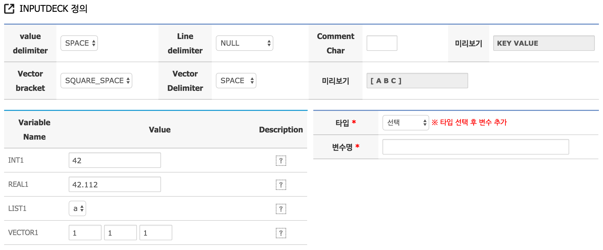

## SDE case study 1

다음과 같이 숫자형 변수 2개(정수형 변수 1개, 실수형 변수 1개), 리스트형 변수 1개, 3차원 벡터 1개를 받는 SDE를 생성했습니다.



데이터 생성 방식은 다음과 같이 설정했습니다.

|KEY	|VALUE| KEY	| VALUE|
|--|--|--|--|
|value delimiter|	SPACE|Vector vracket|	SQUARE_SPACE|
|line delimiter|	NULL|Vector delimiter|	SPACE|

이렇게 설정되어 생성된 입력 파일은 다음과 같습니다.

```
INT1 42
REAL1 42.112
LIST1 a
VECTOR1 [ 1 0 0 ]
```

### Example

```c
#include <stdio.h>
#include <stdlib.h>
#include <string.h>
#include <getopt.h>

typedef struct _inputparam {
    int int1;       
    double real1;      
    char list1;      
    int vector1[3];    
} INPUT;

int main (int argc, char* argv[])
{
    int opt;
    FILE *fp_input ;
    char buf_char[256];
    INPUT input;


    // Detect the end of the options.
    while((opt = getopt(argc, argv, "i:")) != -1 ) {
    	switch(opt) {
    		case 'i':
    			if((fp_input = fopen(optarg,"r")) == NULL ) {
    				fprintf(stderr, "Error opening inputfile Path: %s\n", optarg);
    				return -1;
    			} else {
    				printf("Succeed to open inputfile Path: %s\n", optarg);
    			}
    			break;
    		default:
    			printf("Usage: %s -i [filepath] \n", argv[0]);
    			return -1;
    	}
    }
    while(1) {
        fscanf(fp_input, "%s", buf_char);

        if(feof(fp_input))
            break;

        if(!strcmp(buf_char, "INT1")) {
            fscanf(fp_input, "%d", &input.int1);
        } else if(!strcmp(buf_char, "REAL1")) {
            fscanf(fp_input, "%lf", &input.real1);
        } else if(!strcmp(buf_char, "LIST1")) {
            fscanf(fp_input, "%s", &input.list1);
        } else if(!strcmp(buf_char, "VECTOR1")) {
            fscanf(fp_input, "%*s %d %d %d %*s", &input.vector1[0], &input.vector1[1], &input.vector1[2]);
        } else {
            printf("Error Invalid value name :: %s\n", buf_char);
            exit(1);
        }
    }


    printf("int1: %d \n", input.int1);
    printf("real1: %f \n", input.real1);
    printf("list1: %c \n", input.list1);
    printf("vector1 =  %d %d %d \n",input.vector1[0], input.vector1[1], input.vector1[2]);

    fclose(fp_input);

    return 0;
}

```

> SDE 생성시 데이터 생성 방식을 아래와 같이 설정한다면, 생성되는 입력 파일의 모양이 약간 달라질 것입니다.
>
> |KEY	|VALUE| KEY	| VALUE|
> |--|--|--|--|
> |value delimiter|	EQUAL |Vector vracket|	SQUARE_SPACE|
> |line delimiter|	SEMICOLON |Vector delimiter|	SPACE|
>
> ```
> INT1 = 42 ;
> REAL1 = 42.112 ;
> LIST1 = a ;
> VECTOR1 = [ 1 0 0 ] ;
> ```
> 추가된 value delimiter와 line delimiter를 고려해 코딩을 해야 합니다. ```%*s``` 이용해 변수 이름과 변수 값 사이에 있는 ```=```와 변수 끝에 있는 ```;```을 파일에서 읽기만 하고, 따로 저장하지 않는 부분을 추가하면 됩니다.
> ``` fscanf(fp_input, "%d", &input.int1); ``` -> ``` fscanf(fp_input, "%*s %d %*s", &input.int1); ```
