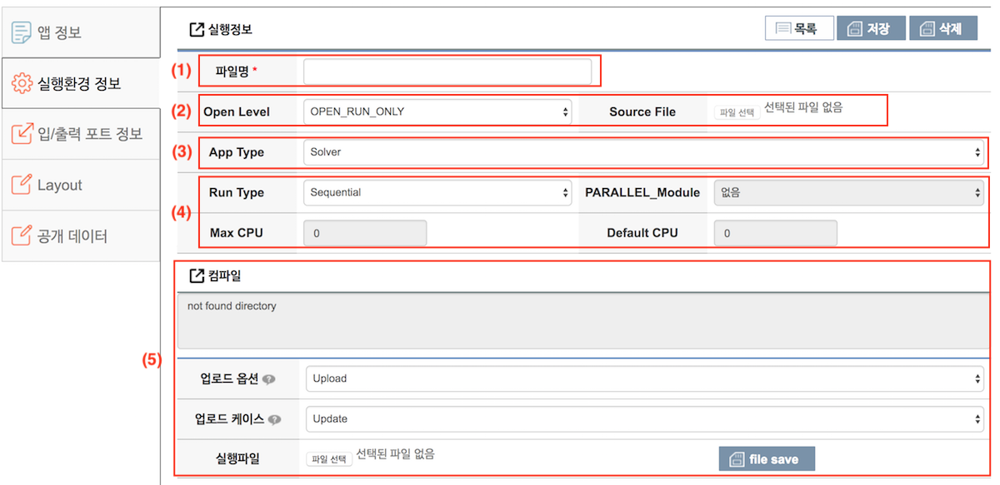

# 실행환경 정보 입력




(1) 업로드 한 실행 파일 명을 입력 이 실행파일명을 바탕으로 앱 테스트 및 시뮬레이션 실행을 하므로 틀리지 않게 작성해야 한다.실행 파일명을 파일 명으로 작성합니다.

(2) Open Level을 설정 해주는 부분 입니다. Open Level은 OPEN_RUN_ONLY와 OPEN_SOURCE, OPEN_BINARY,DOWNLOAD_ONLY 중 하나를 선택할 수 있습니다.

|메뉴|설명|
|--|--|
|OPEN_RUN_ONLY|소스코드나, 바이너리 파일을 올리지 않고 사이언스 앱으로만 서비스를 원하는 경우 이 옵션을 선택하시면 됩니다.|
|OPEN_SOURCE|사용한 소스코드를 업로드하고 싶으신 경우, 이 옵션을 선택하고 Source File에 파일을 업로드 해주시면 됩니다.|
|OPEN_BINARY|사용한 실행파일를 업로드하고 싶으신 경우, 이 옵션을 선택하고 Binary File에 파일을 업로드 해주시면 됩니다.|
|DOWNLOAD_ONLY| 웹사에서 실행하는 앱이 아닌 PC에 다운 받아 사용하는 앱의 경우 이 옵션을 선택하면 됩니다.|

(3) 앱의 타입을 설정합니다.  Solver, Converter 를 선택 할 수 있습니다.
 > Converter는 워크플로우에서 앱과 앱사이 연결시 전달되는 파일의 수정이 필요한 경우 사용하는 모듈입니다.

(4) 앱의 실행 타입을 설정 할 수 있습니다.  실행 타입은 Sequential, Parallel 을 선택 할 수 있습니다. 앱실행 타입이 Parallel 이면 PARALLEL_Module, Max CPU, Default CPU 를 설정 부분이 활성화 되어 설정이 가능해 집니다.

(5) Bulb에서 실행 테스트가 완료된 실행 파일이나 스크립트를 업로드하는 메뉴입니다. zip이나 tar등의 압축된 형태로 실행 파일 부분에 업로드 해주시면 됩니다.
Upload는 빌드가 완료된 실행파일이나 실행 스크립트를 올리는 경우 사용하면 됩니다. Upload 선택시 업로드 캐이스를 Update와 Clean 두가지 옵션을 선택할 수 있습니다.

|업로드 옵션|업로드 케이스|설명|
|--|--|--|
|Upload|Update|빌드가 완료된 실행파일이나 실행 스크립트를 업로드(기존에 업로드된 파일에 덮어씀)|
|Upload|Clean|빌드가 완료된 실행파일이나 실행 스크립트를 업로드(기존에 업로드된 파일들은 삭제됨)|

<!--
|With Compile|File|Makefile과 소스코드를 압축하여 함께 올리는 경우 웹상에서 자동 빌드과정을 수행|
|With Compile|URL|Makefile과 소스코드가 github에 업로드 된 경우, 해당 repository에서 소스코드를 받아와 자동 빌드과정을 수행|
 > DISON 웹포털에서 자동으로 소스 컴파일을 하실수 있습니다. 자동으로 소스 컴파일을 하기위해 선행되야하는 조건은 아래와 같습니다.
 > - 예제와 같이 ```Makefile```과 소스코드는 ```src``` 폴더에 저장되어 있어야 합니다.
 > - ```src``` 폴더 안에서 ```make all``` 커맨드 입력시, 빌드가 수행되며, 실행파일은 ```bin``` ```bin``` 폴더에 저장되야 합니다.
 >
 >[자동 빌드 예제 코드 C언어 -  sin() 함수 출력](https://github.com/sp-edison/c_example_oneD)
 >
 >[자동 빌드 예제 코드 Fortran언어 -  sin() 함수 출력](https://github.com/sp-edison/fortran_example_oneD)

 -->
